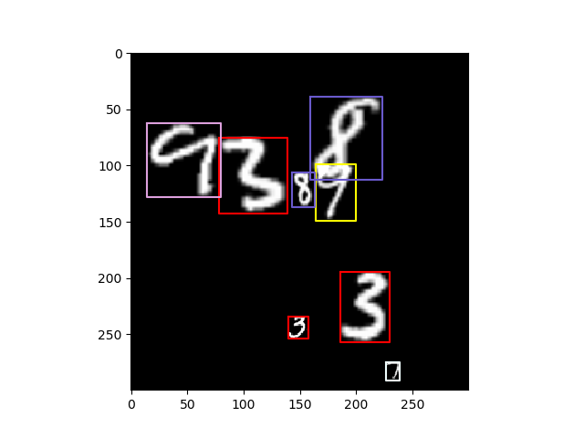

# MNIST Object Detection dataset



Scripts to generate a dataset for object detection on MNIST numbers.
By default, the script generates a dataset with the following attributes:

<!-- - 10,000 images in train. 10,000 images in validation/test
- 10 Classes
- Maximum size of each digit: 100 pixels
- Minimum size of each digit: 15 pixels
- Between 1 and 20 digits per image. -->

### Installation
```bash
uv lock
```

### Generate dataset 
```bash
uv run generate_dataset.py
```

You can also change a bunch of settings by writing:
```bash
uv run generate_dataset.py -h
```

### Visualize dataset
```bash
uv run visualize_dataset.py datasets/mnist_detection/train/
```